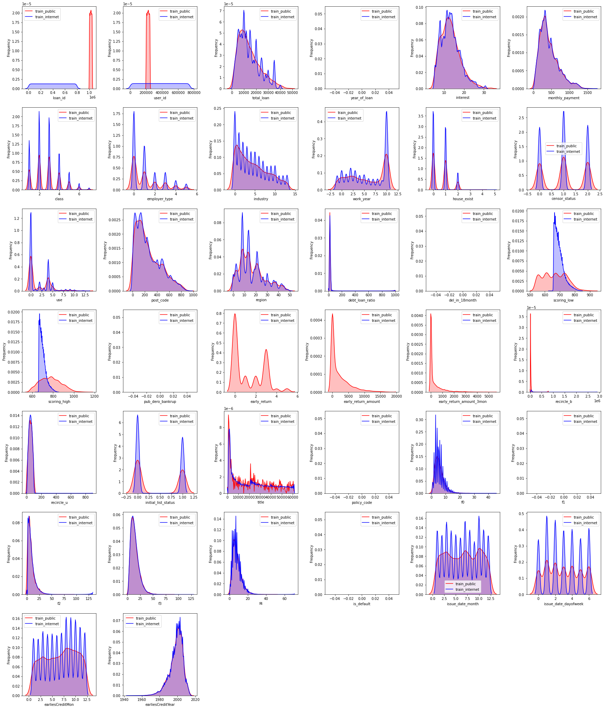
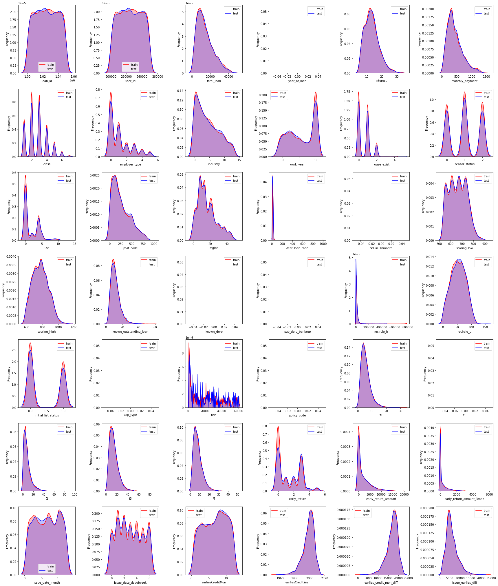

# personal_loan_default_forecast

## This is course project of USTC-DM(data mining), taught by Prof. [Xiangnan HE](https://hexiangnan.github.io/)

I've implemented loan forecast code for the competetion named 中国计算机学会 & 中原银行 [个贷违约预测](https://www.datafountain.cn/competitions/530)

Some visualization results are shown as follows:

## 两个训练集的重叠度分析

## 训练、测试集的重叠度分析

